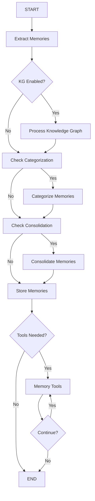
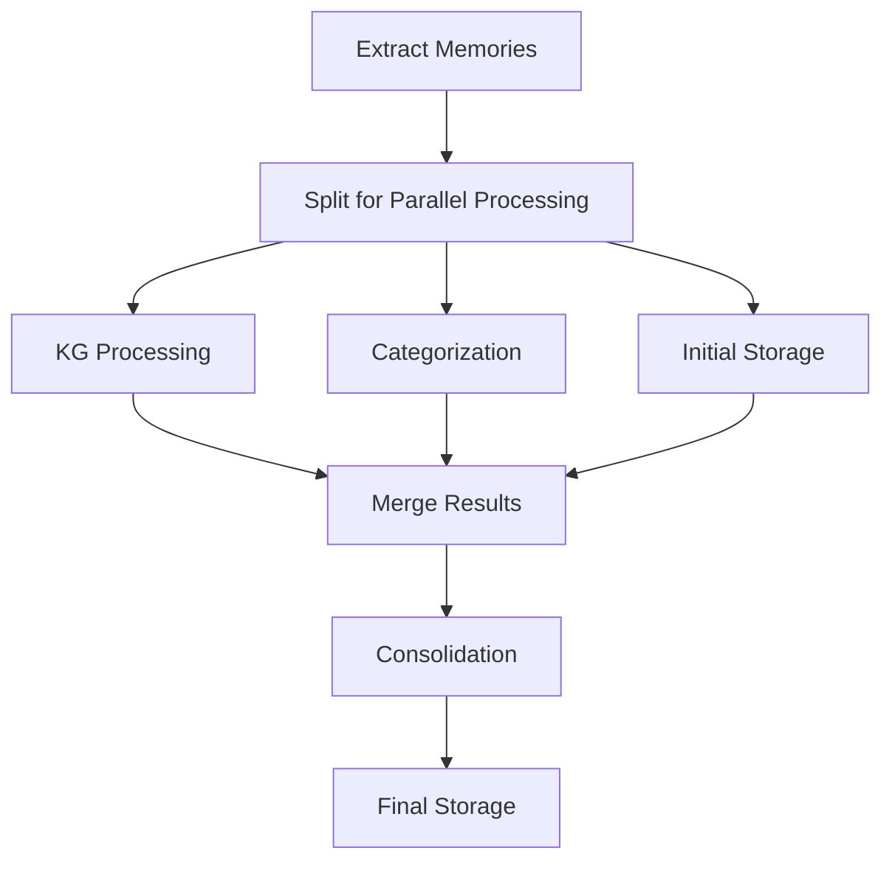
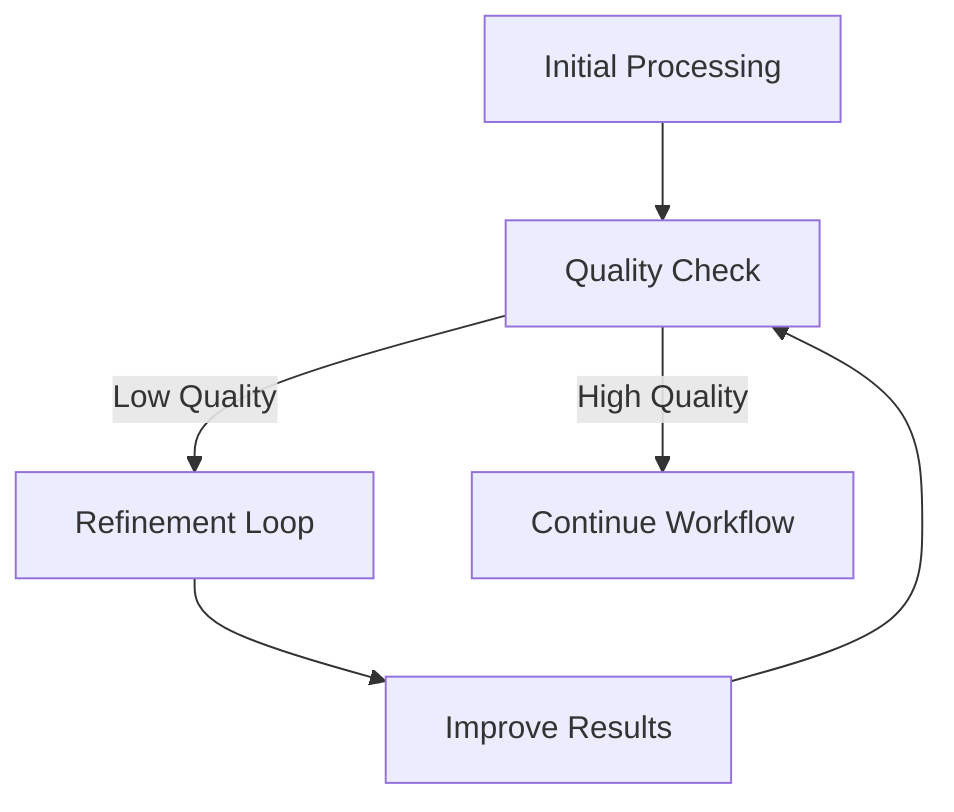
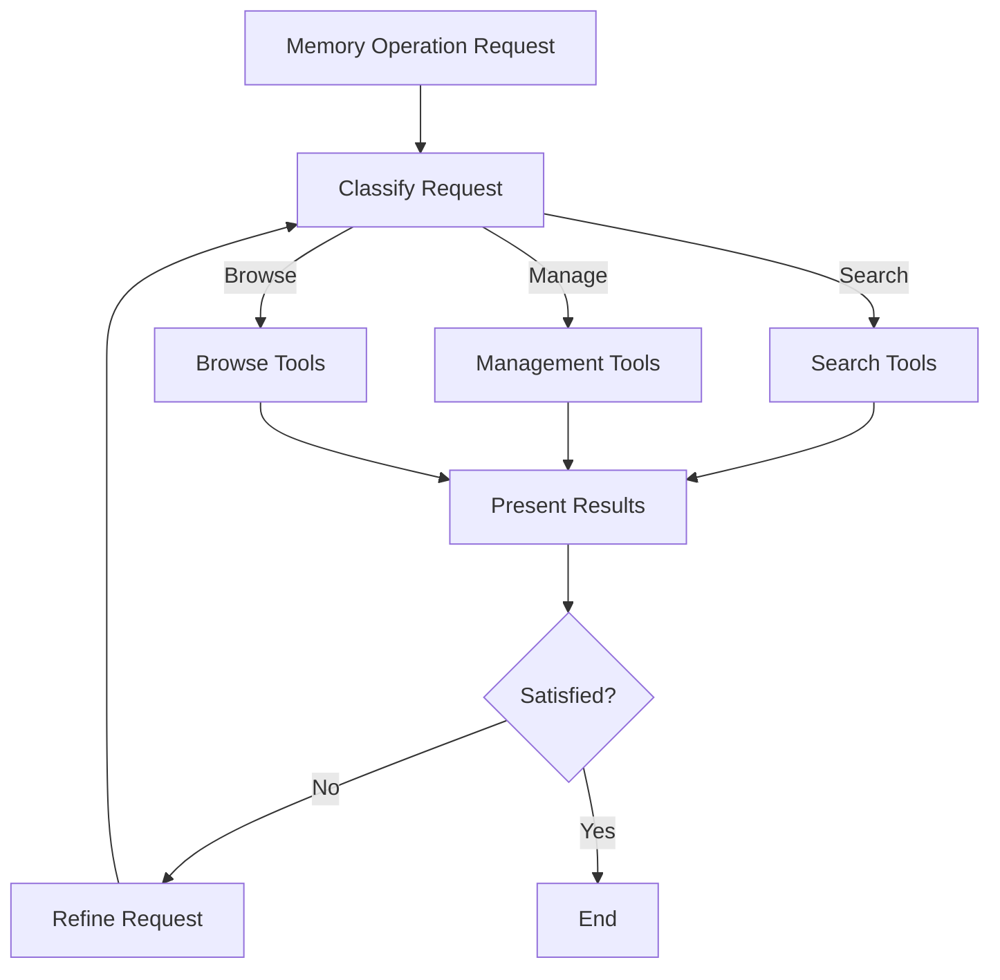

# LTM Graph Flow Design & Architecture

## Overview

This document outlines the graph flow, nodes, edges, and branching logic for the Long-Term Memory (LTM) agent workflow.

## Core Workflow Concepts

### Primary Goals

1. **Memory Extraction**: Extract meaningful memories from conversations
2. **Knowledge Enhancement**: Enrich memories with KG entities/relationships
3. **Categorization**: Organize memories into hierarchical taxonomies
4. **Consolidation**: Summarize and merge related memories
5. **Storage**: Persist enhanced memories for retrieval
6. **Tool Access**: Provide memory management and search capabilities

### Processing Philosophy

- **Configurable Pipeline**: Each processing step can be enabled/disabled
- **Error Resilience**: Failures in one step don't stop the entire workflow
- **Parallel Processing**: Where possible, run independent operations concurrently
- **Tool Integration**: Memory tools available throughout the workflow

## Graph Flow Architecture

### High-Level Flow



### Detailed Node Specifications

#### 1. Extract Memories Node

**Purpose**: Extract structured memories from conversation messages using LangMem patterns

```yaml
Node: extract_memories
Type: EngineNodeConfig
Engine: memory_extraction
Input:
  - messages: list[BaseMessage]
  - existing_memories: list[dict] (optional)
Output:
  - extracted_memories: list[dict]
  - extraction_metadata: dict
Failure Handling:
  - Continue with empty memories list
  - Log extraction errors
```

**Processing Logic**:

1. Use trustcall extractor with memory schemas
2. Support multi-step extraction (up to max_steps)
3. Handle existing memories for updates/merges
4. Generate unique memory IDs

#### 2. Process Knowledge Graph Node

**Purpose**: Extract entities and relationships using Haive's KG components

```yaml
Node: process_kg
Type: EngineNodeConfig
Engine: kg_processing
Input:
  - extracted_memories: list[dict]
Output:
  - knowledge_graph: dict
  - kg_metadata: dict
Conditional: enable_kg_processing = True
Failure Handling:
  - Continue without KG data
  - Log KG processing errors
```

**Processing Logic**:

1. Convert memories to Document objects
2. Use IterativeGraphTransformer or base GraphTransformer
3. Extract entities with confidence scores
4. Identify relationships with supporting evidence
5. Merge duplicate entities

#### 3. Categorize Memories Node

**Purpose**: Organize memories using TNT taxonomy generation

```yaml
Node: categorize_memories
Type: EngineNodeConfig
Engine: categorization
Input:
  - extracted_memories: list[dict]
  - knowledge_graph: dict (optional)
Output:
  - categories: list[str]
  - category_confidence: dict[str, float]
  - taxonomy_tree: dict
Conditional: enable_categorization = True
Failure Handling:
  - Continue with default categories
  - Log categorization errors
```

**Processing Logic**:

1. Group similar memories for batch processing
2. Generate initial taxonomy from memory content
3. Refine categories using iterative improvement
4. Assign confidence scores to categories
5. Build hierarchical taxonomy structure

#### 4. Consolidate Memories Node

**Purpose**: Summarize and merge related memories using iterative summarization

```yaml
Node: consolidate_memories
Type: EngineNodeConfig
Engine: consolidation
Input:
  - extracted_memories: list[dict]
  - categories: list[str] (optional)
  - knowledge_graph: dict (optional)
Output:
  - consolidated_summary: str
  - consolidated_memories: list[dict]
  - consolidation_metadata: dict
Conditional: enable_consolidation = True
Failure Handling:
  - Continue with original memories
  - Log consolidation errors
```

**Processing Logic**:

1. Identify similar/related memories
2. Create progressive summaries using IterativeSummarizer
3. Merge redundant memories while preserving details
4. Update memory relationships
5. Generate consolidation metadata

#### 5. Store Memories Node

**Purpose**: Persist enhanced memories to storage backend

```yaml
Node: store_memories
Type: Custom Node (StorageNodeConfig)
Input:
  - extracted_memories: list[dict]
  - knowledge_graph: dict
  - categories: list[str]
  - consolidated_summary: str
Output:
  - stored_memory_ids: list[str]
  - storage_metadata: dict
Failure Handling:
  - Retry with exponential backoff
  - Store partial results on failure
  - Return error details
```

**Processing Logic**:

1. Enhance memories with processing results
2. Generate embeddings for semantic search
3. Store in configured namespace
4. Update access patterns and metadata
5. Create cross-references between memories

#### 6. Memory Tools Node

**Purpose**: Provide LangMem-compatible tools for memory management

```yaml
Node: memory_tools
Type: ToolNodeConfig
Tools:
  - manage_memory_tool (create/update/delete)
  - search_memory_tool (semantic/graph/categorical)
  - consolidate_memories_tool (manual consolidation)
Input: Current state + tool calls
Output: Tool results + updated state
Conditional: User requests memory operations
```

**Available Tools**:

1. **Manage Memory**: Create, update, delete memories
2. **Search Memory**: Multi-modal memory search
3. **Consolidate**: Manual memory consolidation
4. **Browse Categories**: Explore taxonomy
5. **Memory Stats**: Usage and access patterns

## Branching Logic & Conditions

### 1. Processing Step Conditions

```python
# KG Processing Decision
def should_process_kg(state) -> str:
    if state.get('enable_kg_processing', True) and state.get('extracted_memories'):
        return "process_kg"
    elif state.get('enable_categorization', True):
        return "categorize_memories"
    elif state.get('enable_consolidation', True):
        return "consolidate_memories"
    else:
        return "store_memories"

# Categorization Decision
def should_categorize(state) -> str:
    if state.get('enable_categorization', True) and state.get('extracted_memories'):
        return "categorize_memories"
    elif state.get('enable_consolidation', True):
        return "consolidate_memories"
    else:
        return "store_memories"

# Consolidation Decision
def should_consolidate(state) -> str:
    if state.get('enable_consolidation', True) and state.get('extracted_memories'):
        # Check if consolidation is needed
        memories = state.get('extracted_memories', [])
        if len(memories) >= state.get('consolidation_threshold', 5):
            return "consolidate_memories"
    return "store_memories"
```

### 2. Tool Usage Conditions

```python
def should_use_tools(state) -> str:
    """Determine if memory tools should be activated."""
    messages = state.get('messages', [])
    if not messages:
        return "end"

    last_message = messages[-1].content.lower()

    # Tool activation keywords
    tool_keywords = [
        'remember', 'recall', 'search memory', 'find memory',
        'forget', 'delete memory', 'update memory',
        'what do you know about', 'do you remember',
        'show me memories', 'memory search'
    ]

    if any(keyword in last_message for keyword in tool_keywords):
        return "tools"

    # Check for explicit tool calls
    if hasattr(messages[-1], 'tool_calls') and messages[-1].tool_calls:
        return "tools"

    return "end"

def should_continue_tools(state) -> str:
    """Determine if tool interaction should continue."""
    tool_results = state.get('tool_results', [])
    if not tool_results:
        return "end"

    # Check last tool result for continuation signals
    last_result = tool_results[-1]
    if last_result.get('continue_interaction', False):
        return "tools"

    return "end"
```

### 3. Error Handling Branches

```python
def handle_processing_error(state, error_stage: str) -> str:
    """Handle errors during processing stages."""
    errors = state.get('processing_errors', [])
    errors.append(f"{error_stage}: {error}")

    # Determine next step based on error stage
    if error_stage == "memory_extraction":
        # Can't continue without memories
        return "end"
    elif error_stage == "kg_processing":
        # Continue to categorization
        return "categorize_memories" if state.get('enable_categorization') else "store_memories"
    elif error_stage == "categorization":
        # Continue to consolidation
        return "consolidate_memories" if state.get('enable_consolidation') else "store_memories"
    elif error_stage == "consolidation":
        # Continue to storage
        return "store_memories"
    else:
        # Storage errors - try to save partial results
        return "end"
```

## Advanced Flow Patterns

### 1. Parallel Processing Opportunities



**Parallel Nodes**:

- KG processing and categorization can run concurrently
- Embedding generation can run parallel to other processing
- Multiple memory batches can be processed simultaneously

### 2. Iterative Refinement Loops



**Refinement Triggers**:

- Low confidence scores in KG extraction
- Poor category assignments
- Incomplete memory extraction
- User feedback on memory quality

### 3. User Interaction Patterns



## Node Implementation Strategy

### 1. Core Processing Nodes

- Use `EngineNodeConfig` for LLM-based processing
- Implement engines as separate, testable components
- Support both sync and async operation modes
- Include comprehensive error handling and logging

### 2. Custom Nodes

- Storage node for complex persistence logic
- Merge node for combining parallel processing results
- Quality check node for validation
- User interaction node for tool coordination

### 3. Tool Nodes

- Implement LangMem-compatible tools
- Support streaming responses for long operations
- Include usage tracking and rate limiting
- Provide rich error messages and help

## Configuration-Driven Flow

### Agent Configuration Controls

```python
ltm_config = {
    # Processing toggles
    "enable_kg_processing": True,
    "enable_categorization": True,
    "enable_consolidation": True,
    "enable_parallel_processing": False,

    # Processing parameters
    "max_extraction_steps": 3,
    "consolidation_threshold": 5,
    "kg_confidence_threshold": 0.7,
    "category_min_confidence": 0.5,

    # Flow control
    "retry_failed_steps": True,
    "max_retries": 3,
    "fail_fast": False,

    # Tool configuration
    "create_memory_tools": True,
    "tool_timeout": 30,
    "enable_tool_streaming": True
}
```

### Dynamic Flow Adaptation

- Graph structure adapts based on configuration
- Conditional edges route around disabled features
- Processing parameters adjust based on content volume
- User preferences influence tool behavior

This graph flow design provides a comprehensive, configurable, and resilient workflow for long-term memory processing while maintaining flexibility for different use cases and requirements.
