# RAG Architectures - Detailed Graph Flows

## Table of Contents

1. [Basic/Traditional RAG Architectures](#basictraditional-rag-architectures)
2. [Advanced RAG Architectures](#advanced-rag-architectures)
3. [Query Transformation RAG Architectures](#query-transformation-rag-architectures)
4. [Graph-Based RAG Architectures](#graph-based-rag-architectures)
5. [Modular/Flexible RAG Architectures](#modularflexible-rag-architectures)
6. [Agentic RAG Architectures](#agentic-rag-architectures)
7. [Performance-Optimized RAG Architectures](#performance-optimized-rag-architectures)

---

## Basic/Traditional RAG Architectures

### 1. Naive/Standard RAG

**Purpose**: Basic retrieval and generation pipeline

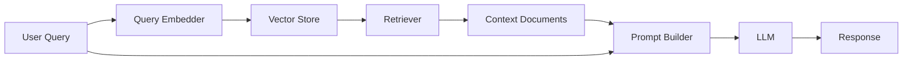
```mermaid
graph LR
    A[User Query] --> B[Query Embedder]
    B --> C[Vector Store]
    C --> D[Retriever]
    D --> E[Context Documents]
    E --> F[Prompt Builder]
    A --> F
    F --> G[LLM]
    G --> H[Response]
```

**Nodes**:

- **Query Embedder**:
  - Input: String (user query)
  - Output: Vector embedding
  - Function: Convert text to vector representation

- **Vector Store**:
  - Input: Query embedding
  - Output: Top-k similar documents
  - Function: Similarity search

- **Prompt Builder**:
  - Input: Query + Retrieved documents
  - Output: Formatted prompt
  - Function: Combine context with query

**Flow**:

```
START -> embed_query -> retrieve_documents -> build_prompt -> generate -> END
```

---

### 2. Simple RAG with Memory

**Purpose**: RAG with conversation history retention

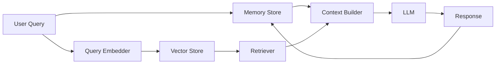
```mermaid
graph LR
    A[User Query] --> B[Memory Store]
    B --> C[Context Builder]
    A --> D[Query Embedder]
    D --> E[Vector Store]
    E --> F[Retriever]
    F --> C
    C --> G[LLM]
    G --> H[Response]
    H --> B
```

**Nodes**:

- **Memory Store**:
  - Input: Previous interactions
  - Output: Conversation history
  - Function: Store/retrieve chat history

- **Context Builder**:
  - Input: Query + Memory + Retrieved docs
  - Output: Enhanced context
  - Function: Merge all context sources

**Conditional Logic**:

```python
if has_conversation_history:
    context = merge(memory, retrieved_docs)
else:
    context = retrieved_docs
```

---

## Advanced RAG Architectures

### 3. Corrective RAG (CRAG)

**Purpose**: Self-correcting retrieval with quality assessment

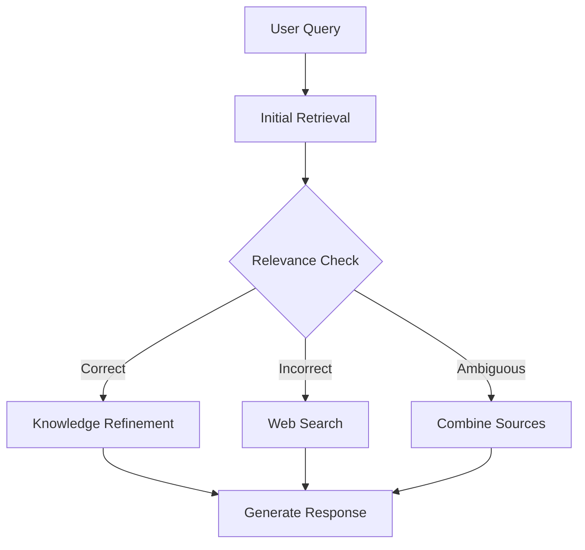
```mermaid
graph TD
    A[User Query] --> B[Initial Retrieval]
    B --> C{Relevance Check}
    C -->|Correct| D[Knowledge Refinement]
    C -->|Incorrect| E[Web Search]
    C -->|Ambiguous| F[Combine Sources]
    D --> G[Generate Response]
    E --> G
    F --> G
```

**Nodes**:

- **Initial Retrieval**:
  - Input: Query
  - Output: Document set + confidence scores
  - Function: Standard RAG retrieval

- **Relevance Check** (Branch Node):
  - Input: Retrieved documents
  - Output: Classification (Correct/Incorrect/Ambiguous)
  - Conditions:
    ```python
    if any(doc.score > threshold):
        return "Correct"
    elif all(doc.score < low_threshold):
        return "Incorrect"
    else:
        return "Ambiguous"
    ```

- **Knowledge Refinement**:
  - Input: Relevant documents
  - Output: Refined knowledge strips
  - Function: Filter and decompose documents

- **Web Search**:
  - Input: Rewritten query
  - Output: Web results
  - Function: External search API call

**Branch Conditions**:

```yaml
branches:
  - condition: relevance_score > 0.8
    goto: knowledge_refinement
  - condition: relevance_score < 0.3
    goto: web_search
  - condition: 0.3 <= relevance_score <= 0.8
    goto: combine_sources
```

---

### 4. Self-RAG

**Purpose**: Adaptive retrieval with self-reflection tokens

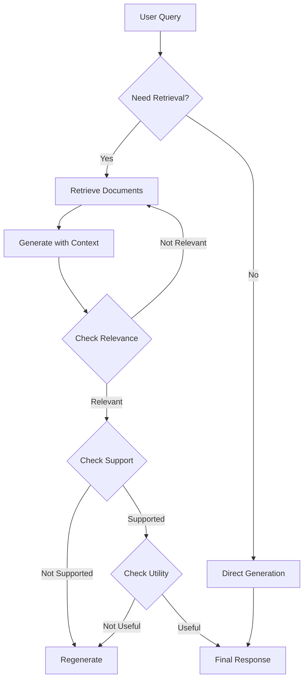
```mermaid
graph TD
    A[User Query] --> B{Need Retrieval?}
    B -->|Yes| C[Retrieve Documents]
    B -->|No| D[Direct Generation]
    C --> E[Generate with Context]
    E --> F{Check Relevance}
    F -->|Not Relevant| C
    F -->|Relevant| G{Check Support}
    G -->|Not Supported| H[Regenerate]
    G -->|Supported| I{Check Utility}
    I -->|Not Useful| H
    I -->|Useful| J[Final Response]
    D --> J
```

**Reflection Tokens**:

- **[Retrieval]**: Signals need for retrieval
- **[ISREL]**: Checks relevance of retrieved docs
- **[ISSUP]**: Verifies factual support
- **[ISUSE]**: Evaluates utility of response

**Node Specifications**:

- **Need Retrieval?** (Decision Node):

  ```python
  def need_retrieval(query, context):
      if requires_external_knowledge(query):
          return "[Retrieval] Yes"
      return "[No Retrieval]"
  ```

- **Check Relevance**:
  ```python
  def check_relevance(docs, query):
      relevance_score = evaluate_relevance(docs, query)
      if relevance_score > threshold:
          return "[ISREL] Relevant"
      return "[ISREL] Not Relevant"
  ```

---

### 5. Adaptive RAG

**Purpose**: Dynamic strategy selection based on query complexity

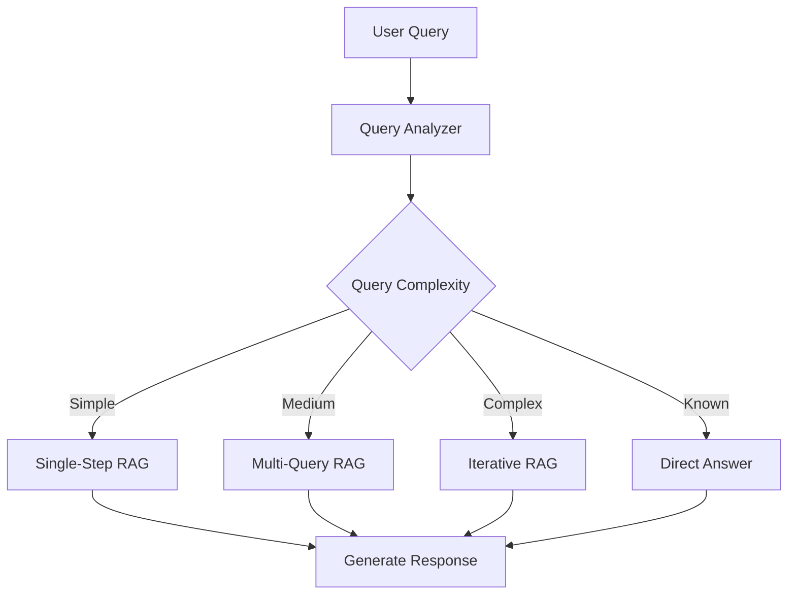
```mermaid
graph TD
    A[User Query] --> B[Query Analyzer]
    B --> C{Query Complexity}
    C -->|Simple| D[Single-Step RAG]
    C -->|Medium| E[Multi-Query RAG]
    C -->|Complex| F[Iterative RAG]
    C -->|Known| G[Direct Answer]
    D --> H[Generate Response]
    E --> H
    F --> H
    G --> H
```

**Query Analyzer Output**:

```python
class QueryAnalysis:
    complexity: str  # simple/medium/complex/known
    topics: List[str]
    requires_multi_hop: bool
    temporal_sensitivity: bool
    domain_specific: bool
```

**Routing Logic**:

```python
def route_query(analysis):
    if analysis.complexity == "simple":
        return single_step_rag
    elif analysis.complexity == "medium":
        return multi_query_rag
    elif analysis.complexity == "complex":
        return iterative_rag
    else:
        return direct_generation
```

---

## Query Transformation RAG Architectures

### 6. Multi-Query RAG

**Purpose**: Improve recall through query diversification

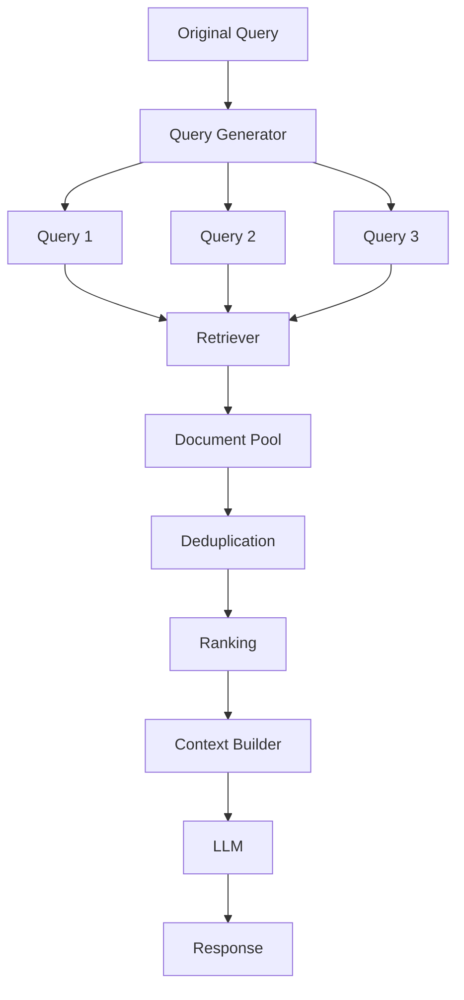
```mermaid
graph TD
    A[Original Query] --> B[Query Generator]
    B --> C[Query 1]
    B --> D[Query 2]
    B --> E[Query 3]
    C --> F[Retriever]
    D --> F
    E --> F
    F --> G[Document Pool]
    G --> H[Deduplication]
    H --> I[Ranking]
    I --> J[Context Builder]
    J --> K[LLM]
    K --> L[Response]
```

**Query Generator Template**:

```python
prompt = """
Generate 3 different versions of this query that capture different aspects:
Original: {query}

1. More specific version:
2. Related broader concept:
3. Alternative phrasing:
"""
```

**Parallel Retrieval**:

```python
async def multi_retrieve(queries):
    results = await asyncio.gather(*[
        retriever.retrieve(q) for q in queries
    ])
    return merge_and_deduplicate(results)
```

---

### 7. RAG Fusion

**Purpose**: Enhanced multi-query with reciprocal rank fusion

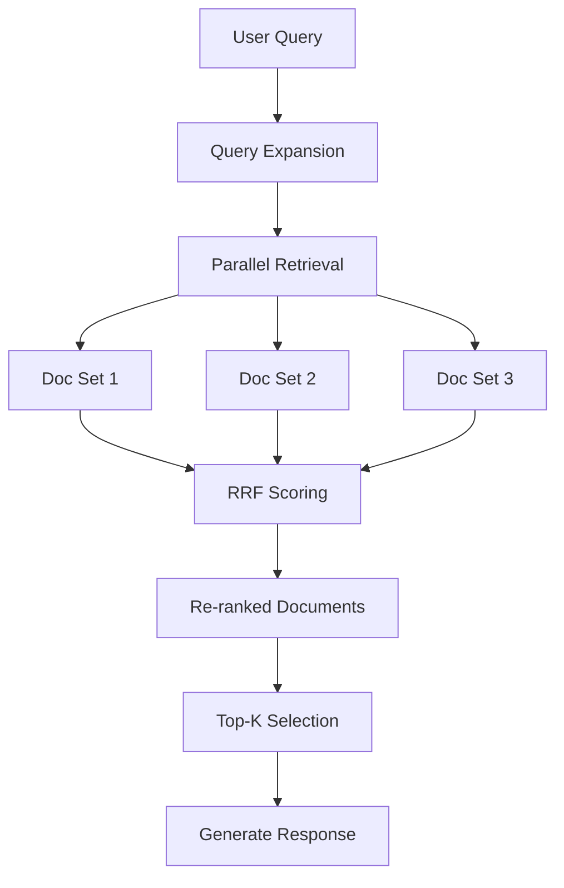
```mermaid
graph TD
    A[User Query] --> B[Query Expansion]
    B --> C[Parallel Retrieval]
    C --> D[Doc Set 1]
    C --> E[Doc Set 2]
    C --> F[Doc Set 3]
    D --> G[RRF Scoring]
    E --> G
    F --> G
    G --> H[Re-ranked Documents]
    H --> I[Top-K Selection]
    I --> J[Generate Response]
```

**Reciprocal Rank Fusion**:

```python
def rrf_score(doc_rankings, k=60):
    """
    doc_rankings: {doc_id: [rank1, rank2, rank3]}
    """
    scores = {}
    for doc_id, ranks in doc_rankings.items():
        score = sum(1 / (k + rank) for rank in ranks)
        scores[doc_id] = score
    return scores
```

---

### 8. HyDE (Hypothetical Document Embeddings)

**Purpose**: Bridge query-document semantic gap

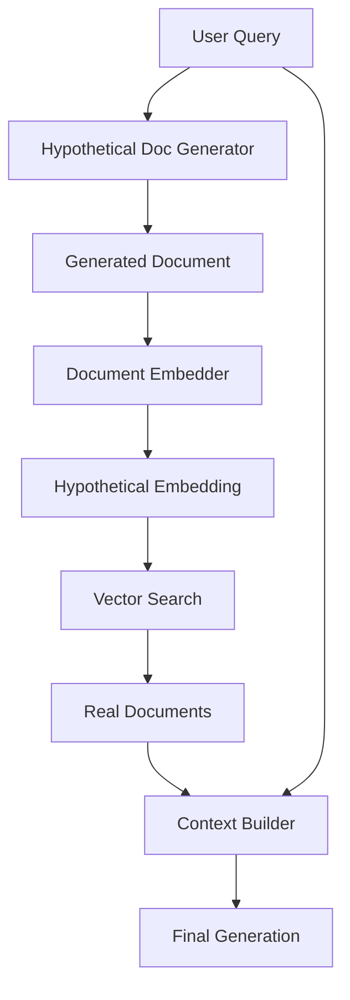
```mermaid
graph TD
    A[User Query] --> B[Hypothetical Doc Generator]
    B --> C[Generated Document]
    C --> D[Document Embedder]
    D --> E[Hypothetical Embedding]
    E --> F[Vector Search]
    F --> G[Real Documents]
    G --> H[Context Builder]
    A --> H
    H --> I[Final Generation]
```

**Hypothetical Document Generator**:

```python
hyde_prompt = """
Write a detailed paragraph that would answer this question:
Question: {query}

Paragraph:
"""
```

**Implementation**:

```python
def hyde_retrieval(query):
    # Generate hypothetical answer
    hyp_doc = llm.generate(hyde_prompt.format(query=query))

    # Embed hypothetical document
    hyp_embedding = embedder.embed(hyp_doc)

    # Retrieve based on hypothetical embedding
    real_docs = vector_store.search(hyp_embedding, k=5)

    return real_docs
```

---

### 9. Step-Back Prompting RAG

**Purpose**: Abstract queries for broader context retrieval

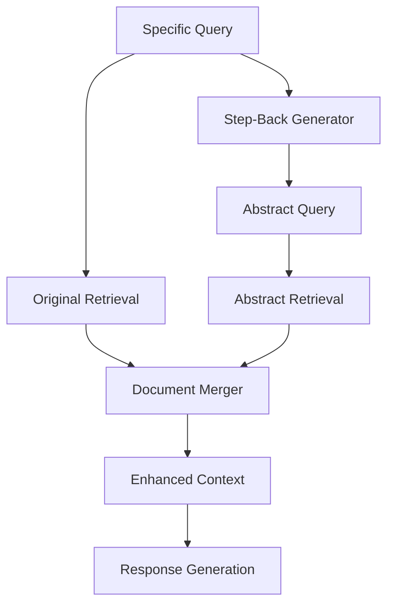
```mermaid
graph TD
    A[Specific Query] --> B[Step-Back Generator]
    B --> C[Abstract Query]
    A --> D[Original Retrieval]
    C --> E[Abstract Retrieval]
    D --> F[Document Merger]
    E --> F
    F --> G[Enhanced Context]
    G --> H[Response Generation]
```

**Step-Back Generator**:

```python
step_back_prompt = """
Given this specific question, generate a more general question about the underlying concept:
Specific: {query}
General:
"""
```

**Example Transformations**:

```yaml
examples:
  - specific: "Why does my LangGraph agent return error X?"
    general: "How does error handling work in LangGraph agents?"

  - specific: "What was Apple's revenue in Q3 2023?"
    general: "What are Apple's financial performance metrics?"
```

---

### 10. Query Decomposition RAG

**Purpose**: Break complex queries into manageable sub-queries

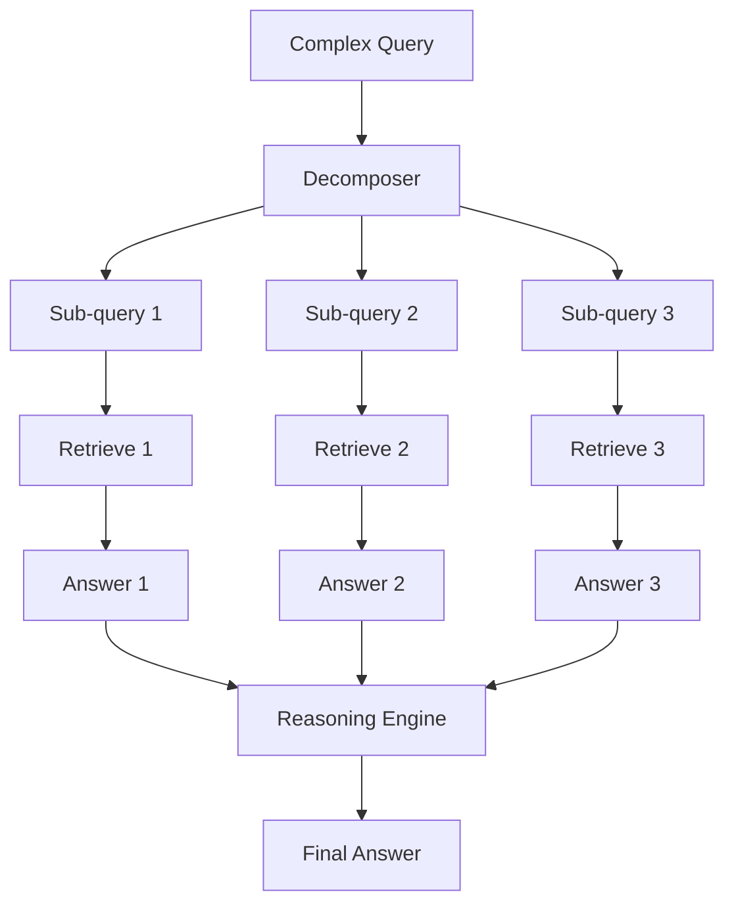
```mermaid
graph TD
    A[Complex Query] --> B[Decomposer]
    B --> C[Sub-query 1]
    B --> D[Sub-query 2]
    B --> E[Sub-query 3]
    C --> F[Retrieve 1]
    D --> G[Retrieve 2]
    E --> H[Retrieve 3]
    F --> I[Answer 1]
    G --> J[Answer 2]
    H --> K[Answer 3]
    I --> L[Reasoning Engine]
    J --> L
    K --> L
    L --> M[Final Answer]
```

**Decomposition Logic**:

```python
class QueryDecomposer:
    def decompose(self, query):
        prompt = f"""
        Break down this complex question into simpler sub-questions:
        {query}

        Sub-questions:
        """
        sub_queries = llm.generate(prompt)
        return parse_sub_queries(sub_queries)
```

**Reasoning Template**:

```python
reasoning_prompt = """
Original question: {original_query}

Sub-questions and answers:
{sub_qa_pairs}

Based on these answers, the final answer is:
"""
```

---

## Graph-Based RAG Architectures

### 11. Graph RAG

**Purpose**: Leverage knowledge graph relationships

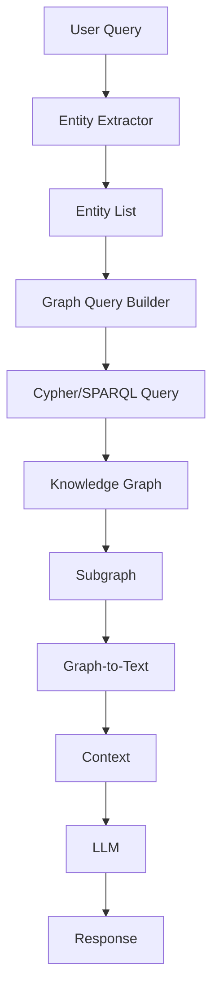
```mermaid
graph TD
    A[User Query] --> B[Entity Extractor]
    B --> C[Entity List]
    C --> D[Graph Query Builder]
    D --> E[Cypher/SPARQL Query]
    E --> F[Knowledge Graph]
    F --> G[Subgraph]
    G --> H[Graph-to-Text]
    H --> I[Context]
    I --> J[LLM]
    J --> K[Response]
```

**Entity Extraction**:

```python
def extract_entities(query):
    # NER or LLM-based extraction
    entities = ner_model(query)
    return {
        "entities": entities,
        "relations": extract_relations(query),
        "properties": extract_properties(query)
    }
```

**Graph Query Generation**:

```cypher
MATCH (e1:Entity {name: $entity1})-[r:RELATED_TO*1..2]-(e2:Entity)
WHERE e2.type IN $relevant_types
RETURN e1, r, e2
LIMIT 50
```

---

### 12. Agentic Graph RAG

**Purpose**: Dynamic graph navigation with agent decision-making

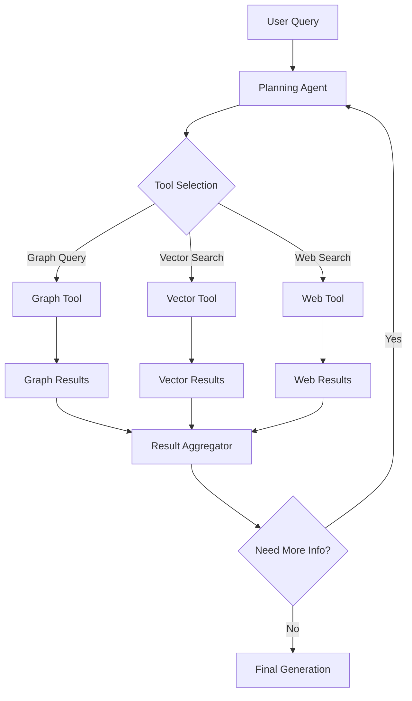
```mermaid
graph TD
    A[User Query] --> B[Planning Agent]
    B --> C{Tool Selection}
    C -->|Graph Query| D[Graph Tool]
    C -->|Vector Search| E[Vector Tool]
    C -->|Web Search| F[Web Tool]
    D --> G[Graph Results]
    E --> H[Vector Results]
    F --> I[Web Results]
    G --> J[Result Aggregator]
    H --> J
    I --> J
    J --> K{Need More Info?}
    K -->|Yes| B
    K -->|No| L[Final Generation]
```

**Agent Decision Logic**:

```python
class GraphRAGAgent:
    def decide_action(self, state):
        if needs_relationship_info(state.query):
            return "graph_query"
        elif needs_semantic_search(state.query):
            return "vector_search"
        elif needs_current_info(state.query):
            return "web_search"
        else:
            return "generate"
```

---

## Modular/Flexible RAG Architectures

### 13. Modular RAG

**Purpose**: Configurable pipeline with swappable components

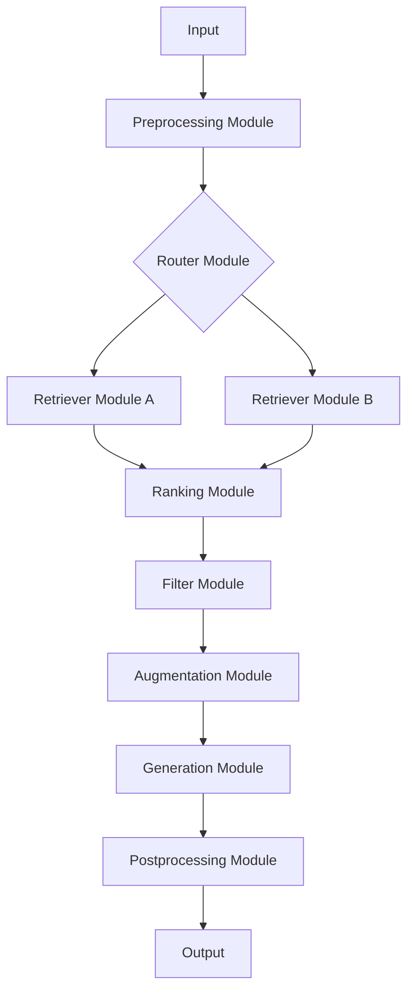
```mermaid
graph TD
    A[Input] --> B[Preprocessing Module]
    B --> C{Router Module}
    C --> D[Retriever Module A]
    C --> E[Retriever Module B]
    D --> F[Ranking Module]
    E --> F
    F --> G[Filter Module]
    G --> H[Augmentation Module]
    H --> I[Generation Module]
    I --> J[Postprocessing Module]
    J --> K[Output]
```

**Module Interface**:

```python
class RAGModule(ABC):
    @abstractmethod
    def process(self, input_data: Dict) -> Dict:
        pass

    @abstractmethod
    def get_config(self) -> Dict:
        pass
```

**Pipeline Configuration**:

```yaml
pipeline:
  modules:
    - name: preprocessor
      type: query_expansion
      config:
        method: multi_query
        num_queries: 3

    - name: retriever
      type: hybrid
      config:
        dense_weight: 0.7
        sparse_weight: 0.3

    - name: reranker
      type: cross_encoder
      config:
        model: "ms-marco-MiniLM"
        top_k: 5
```

---

### 14. Branched RAG

**Purpose**: Source-specific retrieval paths

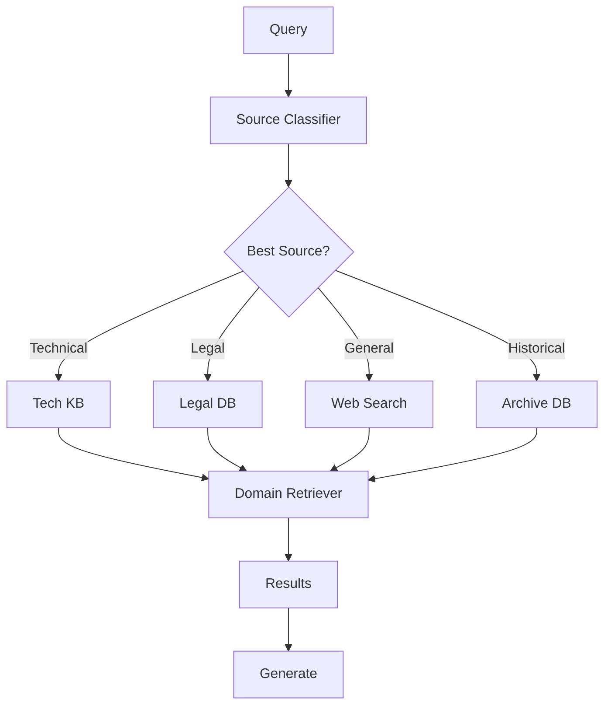
```mermaid
graph TD
    A[Query] --> B[Source Classifier]
    B --> C{Best Source?}
    C -->|Technical| D[Tech KB]
    C -->|Legal| E[Legal DB]
    C -->|General| F[Web Search]
    C -->|Historical| G[Archive DB]
    D --> H[Domain Retriever]
    E --> H
    F --> H
    G --> H
    H --> I[Results]
    I --> J[Generate]
```

**Source Selection**:

```python
def select_source(query, sources):
    scores = {}
    for source in sources:
        score = source.relevance_model(query)
        scores[source.name] = score

    return max(scores.items(), key=lambda x: x[1])[0]
```

---

## Agentic RAG Architectures

### 15. Agentic RAG Router

**Purpose**: Intelligent query routing to specialized tools

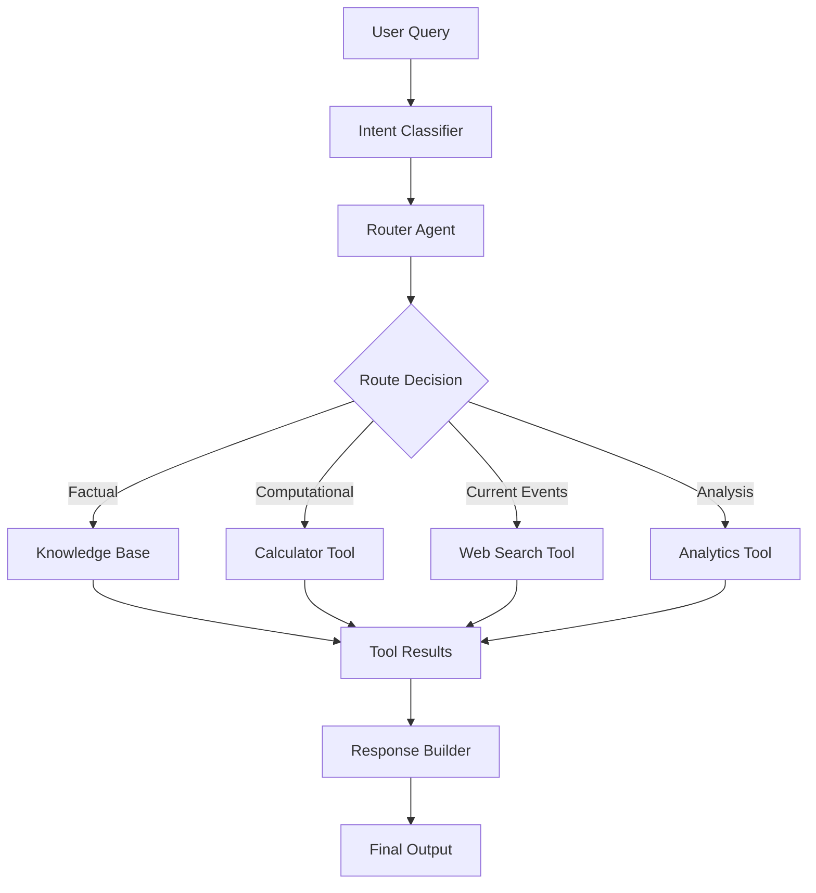
```mermaid
graph TD
    A[User Query] --> B[Intent Classifier]
    B --> C[Router Agent]
    C --> D{Route Decision}
    D -->|Factual| E[Knowledge Base]
    D -->|Computational| F[Calculator Tool]
    D -->|Current Events| G[Web Search Tool]
    D -->|Analysis| H[Analytics Tool]
    E --> I[Tool Results]
    F --> I
    G --> I
    H --> I
    I --> J[Response Builder]
    J --> K[Final Output]
```

**Router Configuration**:

```python
router_config = {
    "routes": [
        {
            "intent": "factual_question",
            "tool": "knowledge_base",
            "confidence_threshold": 0.8
        },
        {
            "intent": "mathematical",
            "tool": "calculator",
            "confidence_threshold": 0.9
        },
        {
            "intent": "current_events",
            "tool": "web_search",
            "confidence_threshold": 0.7
        }
    ]
}
```

---

### 16. Query Planning Agentic RAG

**Purpose**: Complex query orchestration

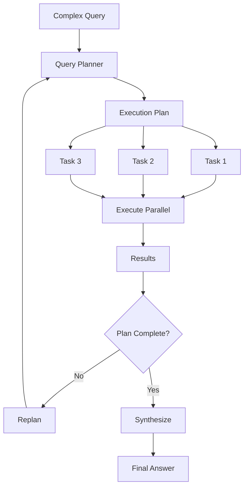
```mermaid
graph TD
    A[Complex Query] --> B[Query Planner]
    B --> C[Execution Plan]
    C --> D[Task 1]
    C --> E[Task 2]
    C --> F[Task 3]
    D --> G[Execute Parallel]
    E --> G
    F --> G
    G --> H[Results]
    H --> I{Plan Complete?}
    I -->|No| J[Replan]
    J --> B
    I -->|Yes| K[Synthesize]
    K --> L[Final Answer]
```

**Execution Plan Structure**:

```python
class ExecutionPlan:
    tasks: List[Task]
    dependencies: Dict[str, List[str]]
    parallel_groups: List[List[str]]

    def can_execute_parallel(self, task_ids):
        # Check if tasks have no interdependencies
        return all(
            task_id not in self.dependencies[other]
            for task_id in task_ids
            for other in task_ids
            if task_id != other
        )
```

---

### 17. Self-Reflective Agentic RAG

**Purpose**: Iterative improvement through reflection

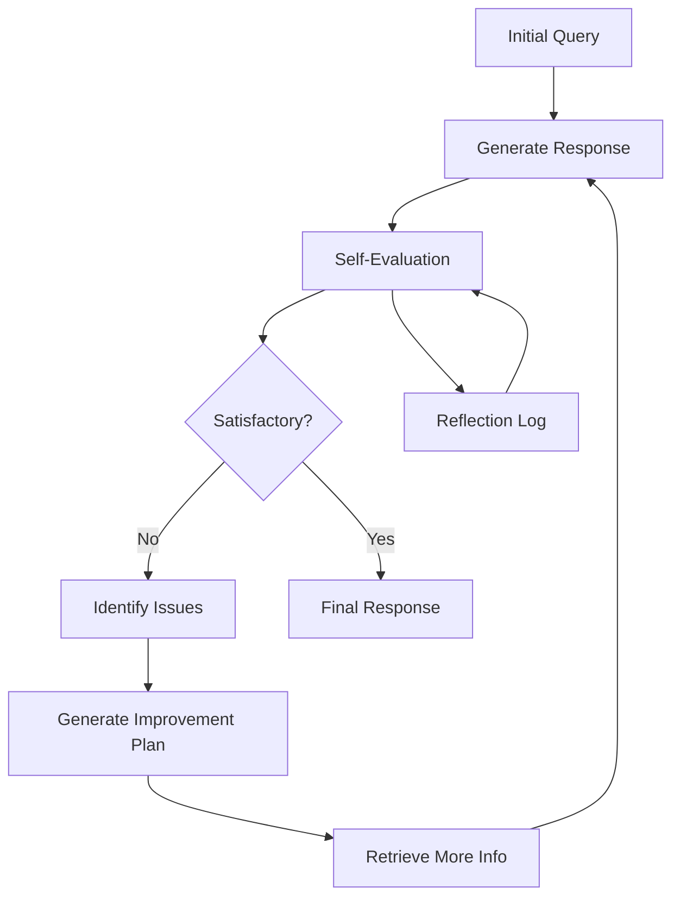
```mermaid
graph TD
    A[Initial Query] --> B[Generate Response]
    B --> C[Self-Evaluation]
    C --> D{Satisfactory?}
    D -->|No| E[Identify Issues]
    E --> F[Generate Improvement Plan]
    F --> G[Retrieve More Info]
    G --> B
    D -->|Yes| H[Final Response]

    I[Reflection Log] --> C
    C --> I
```

**Reflection Criteria**:

```python
class ReflectionCriteria:
    completeness: float  # 0-1
    accuracy: float      # 0-1
    relevance: float     # 0-1
    coherence: float     # 0-1

    def needs_improvement(self):
        return any([
            self.completeness < 0.8,
            self.accuracy < 0.9,
            self.relevance < 0.7,
            self.coherence < 0.8
        ])
```

---

## Performance-Optimized RAG Architectures

### 18. Speculative RAG

**Purpose**: Fast drafting with quality verification

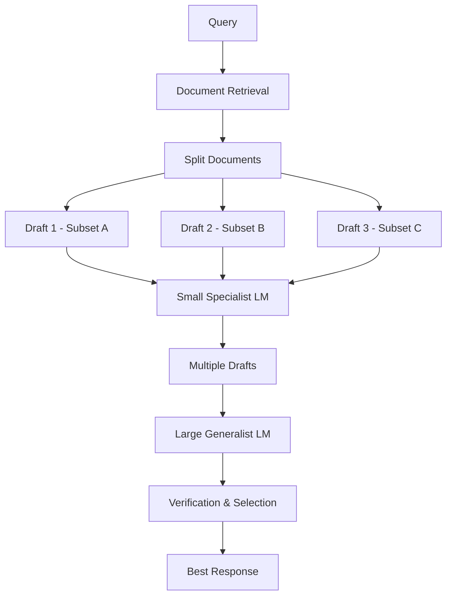
```mermaid
graph TD
    A[Query] --> B[Document Retrieval]
    B --> C[Split Documents]
    C --> D[Draft 1 - Subset A]
    C --> E[Draft 2 - Subset B]
    C --> F[Draft 3 - Subset C]
    D --> G[Small Specialist LM]
    E --> G
    F --> G
    G --> H[Multiple Drafts]
    H --> I[Large Generalist LM]
    I --> J[Verification & Selection]
    J --> K[Best Response]
```

**Parallel Draft Generation**:

```python
async def generate_drafts(query, doc_subsets):
    draft_tasks = []
    for subset in doc_subsets:
        task = specialist_model.generate_async(
            query=query,
            context=subset,
            max_tokens=200
        )
        draft_tasks.append(task)

    drafts = await asyncio.gather(*draft_tasks)
    return drafts
```

**Verification Logic**:

```python
def verify_and_select(drafts, query, full_context):
    scores = []
    for draft in drafts:
        score = generalist_model.score(
            draft=draft,
            query=query,
            context=full_context
        )
        scores.append(score)

    best_idx = np.argmax(scores)
    return drafts[best_idx]
```

---

### 19. Fusion RAG

**Purpose**: Multi-source information integration

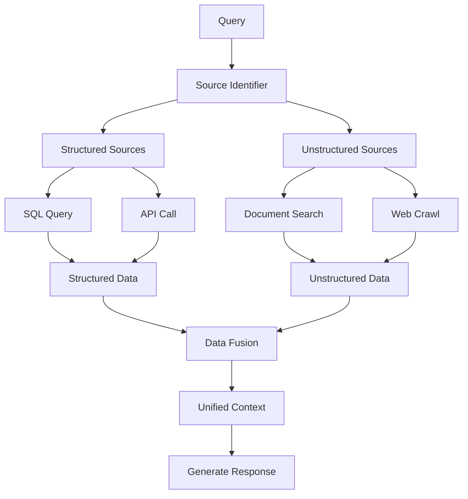
```mermaid
graph TD
    A[Query] --> B[Source Identifier]
    B --> C[Structured Sources]
    B --> D[Unstructured Sources]
    C --> E[SQL Query]
    C --> F[API Call]
    D --> G[Document Search]
    D --> H[Web Crawl]
    E --> I[Structured Data]
    F --> I
    G --> J[Unstructured Data]
    H --> J
    I --> K[Data Fusion]
    J --> K
    K --> L[Unified Context]
    L --> M[Generate Response]
```

**Fusion Strategy**:

```python
class FusionStrategy:
    def fuse(self, structured_data, unstructured_data):
        # Convert structured to text
        structured_text = self.structured_to_text(structured_data)

        # Align and merge
        merged = self.align_information(
            structured_text,
            unstructured_data
        )

        # Resolve conflicts
        resolved = self.resolve_conflicts(merged)

        return resolved
```

---

### 20. Self-Route RAG

**Purpose**: Self-aware routing decisions

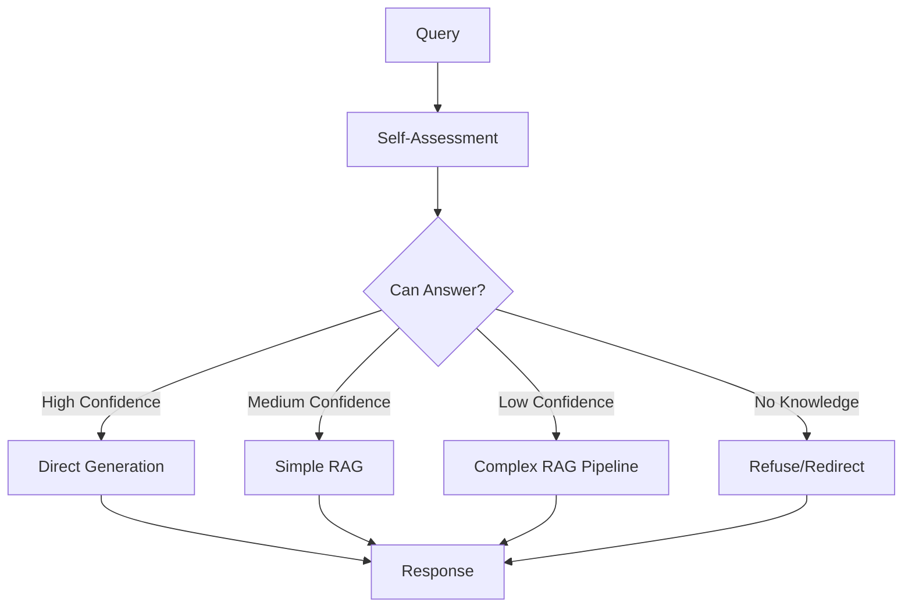
```mermaid
graph TD
    A[Query] --> B[Self-Assessment]
    B --> C{Can Answer?}
    C -->|High Confidence| D[Direct Generation]
    C -->|Medium Confidence| E[Simple RAG]
    C -->|Low Confidence| F[Complex RAG Pipeline]
    C -->|No Knowledge| G[Refuse/Redirect]
    D --> H[Response]
    E --> H
    F --> H
    G --> H
```

**Self-Assessment Logic**:

```python
def self_assess(query, model_knowledge):
    assessment = {
        "knowledge_coverage": check_knowledge_coverage(query),
        "confidence": calculate_confidence(query),
        "complexity": assess_complexity(query),
        "requires_current_info": needs_recent_data(query)
    }

    if assessment["confidence"] > 0.9:
        return "direct_generation"
    elif assessment["confidence"] > 0.6:
        return "simple_rag"
    elif assessment["knowledge_coverage"] > 0.3:
        return "complex_rag"
    else:
        return "cannot_answer"
```

---

## Implementation Guidelines

### Node Types

1. **Input Nodes**: Accept user queries or system inputs
2. **Processing Nodes**: Transform or analyze data
3. **Decision Nodes**: Route based on conditions
4. **Retrieval Nodes**: Fetch information from sources
5. **Generation Nodes**: Produce text outputs
6. **Output Nodes**: Return final results

### Branch Conditions

```python
# Example condition structure
class BranchCondition:
    def __init__(self, field, operator, value, target):
        self.field = field
        self.operator = operator
        self.value = value
        self.target = target

    def evaluate(self, state):
        field_value = getattr(state, self.field)
        if self.operator == ">":
            return field_value > self.value
        elif self.operator == "==":
            return field_value == self.value
        # ... other operators
```

### State Management

```python
class RAGState:
    query: str
    retrieved_docs: List[Document]
    generated_text: str
    metadata: Dict[str, Any]
    history: List[Dict]

    def update(self, **kwargs):
        for key, value in kwargs.items():
            setattr(self, key, value)
        self.history.append({
            "timestamp": datetime.now(),
            "updates": kwargs
        })
```

### Error Handling

```python
class RAGErrorHandler:
    def handle_retrieval_failure(self, error):
        # Fallback strategies
        return {
            "use_cache": True,
            "expand_search": True,
            "notify_user": True
        }

    def handle_generation_failure(self, error):
        # Recovery options
        return {
            "retry_with_different_prompt": True,
            "use_simpler_model": True,
            "return_partial_result": True
        }
```

This comprehensive guide provides the building blocks needed to implement each RAG architecture with proper flow control, conditional logic, and modular design.
