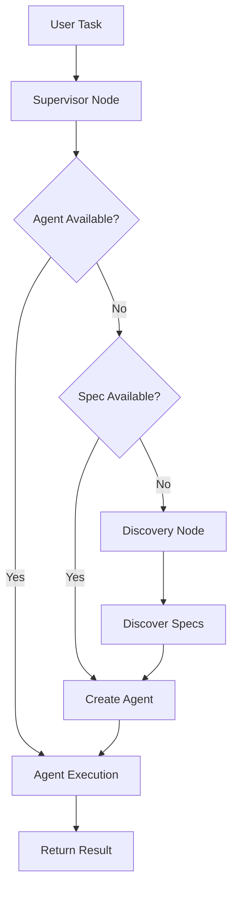

# Supervisor Agent - Dynamic Runtime Agent Management

**Advanced Runtime Agent Discovery and Management**

Version: 1.0.0  
Status: Production Ready  
Last Updated: January 2025

## 🚀 Overview

The Supervisor Agent (DynamicSupervisor) is a powerful, production-ready supervisor implementation that can discover, create, and manage agents at runtime based on task requirements. Unlike traditional supervisors with fixed agent pools, this supervisor dynamically instantiates specialized agents on-demand from specifications.

### Key Features

- **🔍 Dynamic Agent Discovery**: Create agents at runtime from specifications
- **🎯 Intelligent Task Routing**: Match tasks to agents based on capabilities
- **📊 Performance Tracking**: Monitor agent and supervisor metrics
- **🔄 Lifecycle Management**: Handle agent creation, activation, and cleanup
- **🛠️ Extensible Discovery**: Support for multiple discovery modes
- **🧰 Management Tools**: Built-in tools for agent inspection and stats

## 📦 Installation

```python
# The module is part of haive-agents
from haive.agents.supervisor import (
    DynamicSupervisor,
    AgentSpec,
    AgentCapability,
    create_dynamic_supervisor
)
```

## 🎯 Quick Start

### Basic Usage

```python
from haive.agents.dynamic_supervisor_v2 import DynamicSupervisor, AgentSpec
from langchain_core.tools import tool

# Define tools
@tool
def calculator(expression: str) -> str:
    """Calculate mathematical expressions."""
    return str(eval(expression))

@tool
def web_search(query: str) -> str:
    """Search the web for information."""
    return f"Search results for: {query}"

# Define agent specifications
agent_specs = [
    AgentSpec(
        name="math_expert",
        agent_type="ReactAgent",
        description="Expert at mathematical calculations and analysis",
        specialties=["math", "calculation", "algebra", "statistics"],
        tools=[calculator],
        config={
            "temperature": 0.1,
            "system_message": "You are a mathematics expert. Use tools for calculations."
        }
    ),
    AgentSpec(
        name="researcher",
        agent_type="ReactAgent",
        description="Research and information gathering specialist",
        specialties=["research", "search", "analysis", "information"],
        tools=[web_search],
        config={
            "temperature": 0.5,
            "system_message": "You are a research specialist. Find and analyze information."
        }
    ),
    AgentSpec(
        name="writer",
        agent_type="SimpleAgentV3",
        description="Content creation and writing expert",
        specialties=["writing", "content", "documentation", "creative"],
        config={
            "temperature": 0.8,
            "system_message": "You are a skilled writer. Create clear, engaging content."
        }
    )
]

# Create supervisor
supervisor = DynamicSupervisor(
    name="task_coordinator",
    agent_specs=agent_specs,
    max_agents=10,
    auto_discover=True
)

# Run tasks - supervisor will create agents as needed
result1 = await supervisor.arun("Calculate the compound interest on $1000 at 5% for 10 years")
result2 = await supervisor.arun("Research the latest developments in quantum computing")
result3 = await supervisor.arun("Write a blog post about the research findings")

# Check metrics
metrics = supervisor.get_metrics()
print(f"Tasks completed: {metrics['supervisor']['total_tasks']}")
print(f"Agents created: {metrics['supervisor']['agent_creations']}")
```

## 🏗️ Architecture

### Component Structure

```
supervisor/
├── __init__.py          # Public API exports
├── models.py            # Data models (AgentSpec, AgentCapability, etc.)
├── state.py             # State management (DynamicSupervisorState, ActiveAgent)
├── tools.py             # Utilities (agent creation, discovery, matching)
└── agent.py             # Main DynamicSupervisor class
```

### Execution Flow



## 📊 Core Concepts

### Agent Specifications (AgentSpec)

Define everything needed to create an agent:

```python
spec = AgentSpec(
    name="code_reviewer",
    agent_type="ReactAgent",  # SimpleAgentV3 or ReactAgent
    description="Expert code reviewer and analyzer",
    specialties=["code review", "python", "best practices"],
    tools=[code_analyzer_tool, linter_tool],
    config={
        "temperature": 0.2,
        "system_message": "You are an expert code reviewer focusing on quality and security.",
        "max_tokens": 2000
    },
    priority=10  # Higher priority agents are preferred
)
```

### Agent Capabilities

Rich metadata for intelligent matching:

```python
capability = AgentCapability(
    name="data_analyst",
    agent_type="ReactAgent",
    description="Data analysis and visualization expert",
    specialties=["data", "analytics", "visualization", "pandas"],
    tools=["data_analyzer", "chart_creator"],
    performance_score=0.95,  # Historical performance
    usage_count=42,
    last_used="2025-01-15T10:30:00"
)

# Automatic task matching
score = capability.matches_task("analyze sales data and create charts")
# Returns: 0.8 (high match)
```

### Discovery Modes

```python
from haive.agents.dynamic_supervisor_v2 import AgentDiscoveryMode

# Manual mode (default) - only use provided specs
supervisor = DynamicSupervisor(
    agent_specs=specs,
    discovery_config=DiscoveryConfig(mode=AgentDiscoveryMode.MANUAL)
)

# Future modes (planned):
# - COMPONENT_DISCOVERY: Scan installed components
# - RAG_DISCOVERY: Use vector search to find agents
# - MCP_DISCOVERY: Query Model Context Protocol servers
# - HYBRID: Combine multiple methods
```

## 🛠️ Advanced Usage

### Custom Agent Types

```python
# Support for any agent type that follows the pattern
spec = AgentSpec(
    name="custom_agent",
    agent_type="MyCustomAgent",  # Your custom agent class
    config={
        "special_param": "value",
        "engine": AugLLMConfig(temperature=0.5)
    }
)
```

### Management Tools

```python
# Supervisor includes management tools by default
supervisor = DynamicSupervisor(
    agent_specs=specs,
    include_management_tools=True  # Default
)

# Available tools:
# - list_available_agents: Show all active agents and capabilities
# - view_agent_statistics: Display performance metrics
```

### Performance Optimization

```python
# Configure capacity and cleanup
supervisor = DynamicSupervisor(
    agent_specs=specs,
    max_agents=20,  # Maximum active agents
    auto_discover=False,  # Disable auto-discovery for speed
)

# Agents are automatically cleaned up using LRU when at capacity
```

### Structured Output

```python
from pydantic import BaseModel

class AnalysisResult(BaseModel):
    summary: str
    key_points: List[str]
    confidence: float

# Agent spec with structured output
spec = AgentSpec(
    name="analyzer",
    agent_type="SimpleAgentV3",
    config={
        "temperature": 0.3,
        "structured_output_model": AnalysisResult
    }
)
```

## 📈 Monitoring and Metrics

```python
# Get comprehensive metrics
metrics = supervisor.get_metrics()

# Supervisor metrics
print(f"Total tasks: {metrics['supervisor']['total_tasks']}")
print(f"Success rate: {metrics['supervisor']['success_rate']:.1%}")
print(f"Discovery success: {metrics['supervisor']['discovery_success_rate']:.1%}")
print(f"Uptime: {metrics['supervisor']['uptime_hours']:.1f} hours")

# Per-agent metrics
for agent_name, stats in metrics['agents'].items():
    print(f"\n{agent_name}:")
    print(f"  Tasks: {stats['task_count']}")
    print(f"  Success rate: {stats['success_rate']:.1%}")
    print(f"  Avg time: {stats['avg_execution_time']:.2f}s")
    print(f"  State: {stats['state']}")
```

## 🧪 Testing

```python
import pytest
from haive.agents.supervisor import (
    DynamicSupervisor,
    AgentSpec,
    create_dynamic_supervisor
)

@pytest.mark.asyncio
async def test_dynamic_agent_creation():
    """Test that supervisor creates agents on demand."""
    # Define test spec
    spec = AgentSpec(
        name="test_agent",
        agent_type="SimpleAgentV3",
        description="Test agent",
        specialties=["test", "demo"]
    )

    # Create supervisor
    supervisor = create_dynamic_supervisor(
        name="test_supervisor",
        agent_specs=[spec]
    )

    # Initially no active agents
    assert len(supervisor._state["active_agents"]) == 0

    # Run task that matches spec
    result = await supervisor.arun("This is a test task")

    # Agent should be created
    assert len(supervisor._state["active_agents"]) == 1
    assert "test_agent" in supervisor._state["active_agents"]
```

## 🔧 Configuration Reference

### DynamicSupervisor Parameters

| Parameter                  | Type            | Default     | Description                  |
| -------------------------- | --------------- | ----------- | ---------------------------- |
| `name`                     | str             | required    | Supervisor identifier        |
| `engine`                   | AugLLMConfig    | auto        | LLM config for supervisor    |
| `agent_specs`              | List[AgentSpec] | []          | Initial agent specifications |
| `discovery_config`         | DiscoveryConfig | manual mode | Discovery settings           |
| `max_agents`               | int             | 10          | Maximum active agents        |
| `auto_discover`            | bool            | True        | Enable automatic discovery   |
| `include_management_tools` | bool            | True        | Add management tools         |

### AgentSpec Fields

| Field         | Type           | Required | Description                          |
| ------------- | -------------- | -------- | ------------------------------------ |
| `name`        | str            | Yes      | Unique agent identifier              |
| `agent_type`  | str            | No       | Agent class (default: SimpleAgentV3) |
| `description` | str            | Yes      | What the agent does                  |
| `specialties` | List[str]      | No       | Task matching keywords               |
| `tools`       | List[Any]      | No       | Tools for the agent                  |
| `config`      | Dict[str, Any] | No       | Agent configuration                  |
| `priority`    | int            | No       | Selection priority                   |
| `enabled`     | bool           | No       | Whether spec is active               |

## 🚀 Best Practices

1. **Design Focused Agents**: Create agents with clear, specific purposes
2. **Use Descriptive Specialties**: Help the matching algorithm with good keywords
3. **Set Appropriate Temperatures**: Low for analytical, high for creative
4. **Monitor Metrics**: Track performance and optimize based on data
5. **Manage Capacity**: Set `max_agents` based on your resource constraints
6. **Cache Discoveries**: Enable caching for frequently used agent types

## 🔮 Future Enhancements

- **Component Discovery**: Automatically find agents in installed packages
- **RAG Discovery**: Use vector search to find relevant agent implementations
- **MCP Integration**: Discover agents through Model Context Protocol
- **Agent Templates**: Pre-built templates for common agent types
- **Performance Profiling**: Detailed performance analysis per agent
- **Agent Versioning**: Support for multiple versions of the same agent

## 📚 Related Documentation

- [Multi-Agent Patterns](../multi/README.md)
- [ReactAgent Documentation](../react/README.md)
- [SimpleAgentV3 Documentation](../simple/README.md)
- [Haive Core Engine](../../../haive-core/README.md)

## 🤝 Contributing

When contributing to Dynamic Supervisor V2:

1. Follow Google-style docstrings
2. Add comprehensive tests (no mocks)
3. Update this README with new features
4. Ensure backward compatibility
5. Add examples for new functionality

---

**Note**: This is a clean reimplementation based on the working dynamic discovery pattern from the examples, elevated to a production-ready module with proper structure, documentation, and testing.
